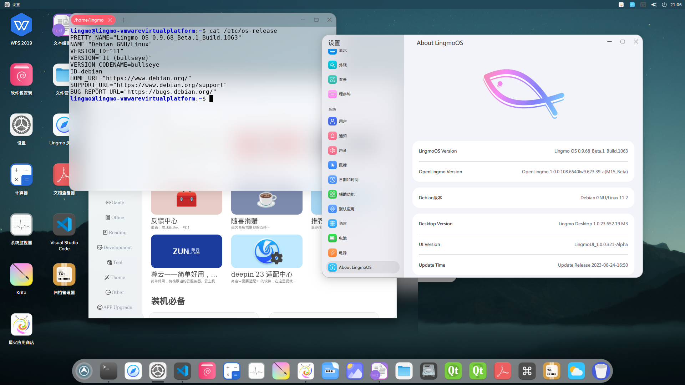

# Lingmo OS - 灵墨操作系统
> [LingmoOS官网](https://lingmo.org/)

### 介绍

Lingmo GNU/Linux（Lingmo OS）是一个以桌面环境为主的Linux操作系统，它基于开源Linux内核开发，适配amd64架构。 它拥有美观的桌面环境、包含适配该桌面环境的软件、统一的UI风格。Lingmo GNU/Linux的目标 是让用户在低性能硬件上拥有华丽且实用的桌面环境以及流畅的体验。
### 轻量化，流畅体验

Lingmo OS 可以在一些低性能硬件上运行，相比传统的桌面操作系统，Lingmo OS 更加轻量、流畅。

### UI、全新的桌面环境

Lingmo OS 采取了全新的不同于传统 KDE 的设计，让操作不再繁琐；我们也对 cutefishDE 做了一些优化和重构，使操作更加符合用户，让交互与视觉更加有活力

### 内置星火软件商店

我们为了改善 Linux 用户的体验，内置了[星火软件商店](https://gitee.com/deepin-community-store/spark-store/)，用户可以在商店内下载所需的软件，使安装软件不用每次都使用命令行。

### 参考文档

>[LingmoOS参考文档](https://lingmo.org/doc/)

### 关于此存储库

此存储库为Lingmo DE的核心代码库

### 开发

由于LingmoOS的开发者很少，所以我们也希望更多人加入LingmoOS项目。
