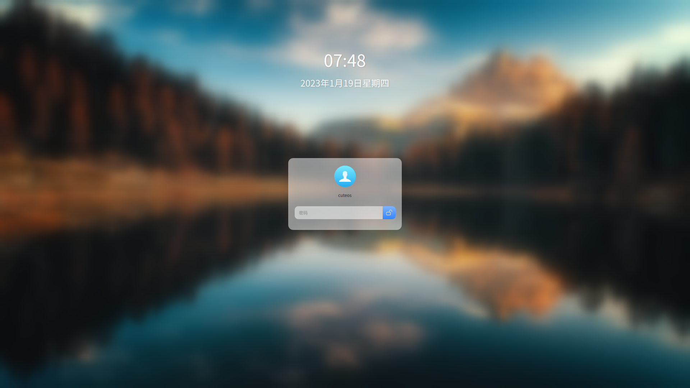

# SDDM theme of LingmoOS
This repository is an SDDM theme repository for LingmoOS, which contains SDDM themes



## Dependent package

For Debian/Ubuntu:
```shell
apt install build-essential cmake extra-cmake-modules qtbase5-dev qtdeclarative5-dev qtquickcontrols2-5-dev qttools5-dev qttools5-dev-tools
```

## Build
```shell
mkdir build
cd build
cmake ..
make
```

## License

This project has been licensed by GPLv3.