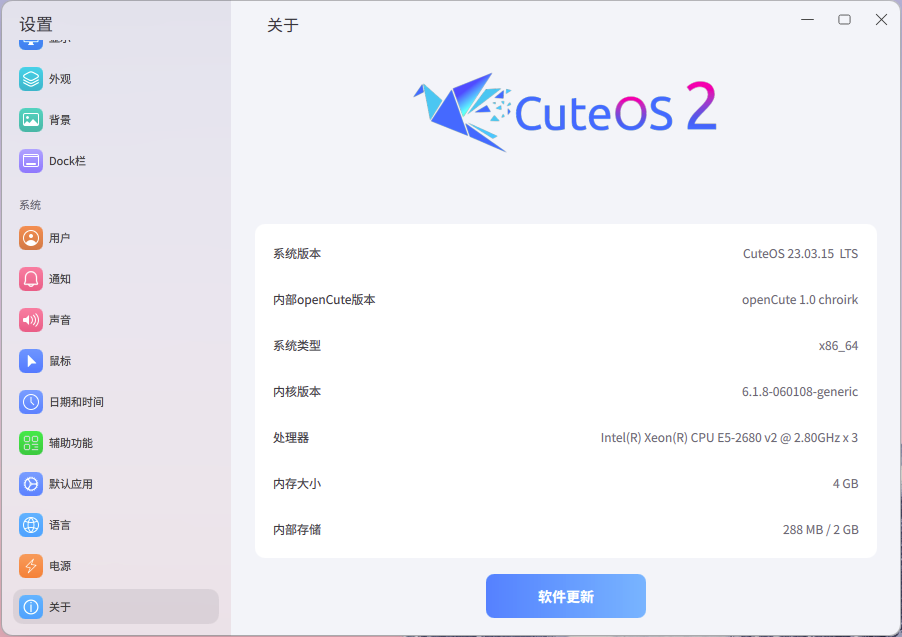

# Lingmo-Settings

The system settings application for LingmoOS uses LingmoUI as the interface style.



## Dependencies
Arch/Manjaro Dependencies:
```shell
sudo pacman -S extra-cmake-modules qt5-base qt5-quickcontrols2 freetype2 fontconfig networkmanager-qt modemmanager-qt
```

Debian/Ubuntu Dependencies:
```shell
sudo apt install cmake debhelper extra-cmake-modules libicu-dev libcrypt-dev libfreetype6-dev libfontconfig1-dev libkf5networkmanagerqt-dev libkf5config-dev modemmanager-qt-dev qtbase5-dev qtdeclarative5-dev qtquickcontrols2-5-dev qttools5-dev qttools5-dev-tools qml-module-qtquick-controls2 qml-module-qtquick2 qml-module-qtquick-layouts qml-module-qt-labs-platform qml-module-qt-labs-settings qml-module-qtqml qml-module-qtquick-window2 qml-module-qtquick-shapes qml-module-qtquick-dialogs qml-module-qtquick-particles2
```

## Build

```shell
mkdir build
cd build
cmake -DCMAKE_INSTALL_PREFIX:PATH=/usr ..
make
sudo make install
```

## License

This project has been licensed by GPLv3.
